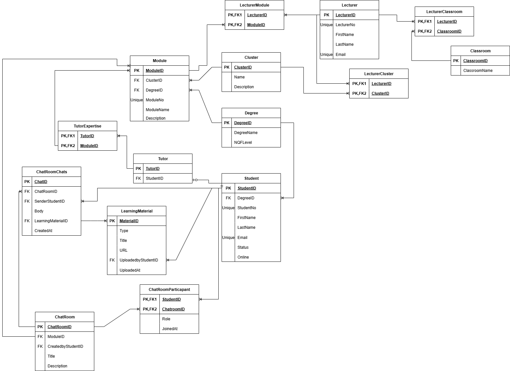

# CampusLearn™ Database Normalization

This document outlines the normalization process for the CampusLearn™ schema, progressing from **Unnormalized Form (UNF)** to **Third Normal Form (3NF)**. The purpose is to eliminate redundancy, maintain consistency, and align with the business rules of the system.

---
## Step 1: UNF → 1NF (Atomicity)

**UNF Example – Lecturer (repeating group):**

| LecturerID | LecturerNo | FirstName | LastName | Email             | Modules Taught              |
|------------|------------|-----------|----------|-------------------|-----------------------------|
| L01        | 896045     | Jan       | Moyo     | jmoyo@campus.ac.za| {MLG381, MLG382, LPR281}    |

Problem: *Modules Taught* contains multiple values → violates 1NF.  

**Conversion to 1NF (separate junction table):**

- `Lecturer(LecturerID, LecturerNo, FirstName, LastName, Email)`  
- `LecturerModule(LecturerID, ModuleID)`

**1NF Example – LecturerModule:**

| LecturerID | ModuleID |
|------------|----------|
| L01        | MLG381   |
| L01        | MLG382   |
| L01        | LPR281   |

Each attribute is atomic.

*(Insert Diagram: `docs/images/unf_to_1nf.png`)*

---

## Step 2: 1NF → 2NF (No Partial Dependencies)

**Problematic 1NF Example – ChatRoomParticipant:**

| ChatRoomID | StudentID | Role     | JoinedAt   | FirstName |
|------------|-----------|----------|------------|-----------|
| CR01       | S10       | Member   | 2025-01-16 | John      |
| CR01       | S18       | Owner    | 2025-01-12 | Sarah     |

*FirstName* depends only on `StudentID`, not the full key (`ChatRoomID`, `StudentID`).  

**Conversion to 2NF:**
- `ChatRoomParticipant(ChatRoomID, StudentID, Role, JoinedAt)`  
- `Student(StudentID, FirstName, LastName, DegreeID, Email, Status, Online)`

**2NF Example – ChatRoomParticipant:**

| ChatRoomID | StudentID | Role     | JoinedAt   |
|------------|-----------|----------|------------|
| CR01       | S10       | Member   | 2025-01-16 |
| CR01       | S18       | Owner    | 2025-01-12 |

Non-key attributes depend on the full composite key.

*(Insert Diagram: `docs/images/1nf_to_2nf.png`)*

---

## Step 3: 2NF → 3NF (No Transitive Dependencies)

**2NF Example – Module table with embedded details:**

| ModuleID | ModuleNo | ModuleName       | ClusterID | ClusterName   | DegreeID | DegreeName |
|----------|----------|------------------|-----------|---------------|----------|------------|
| M01      | MLG381   | Machine Learning | C01       | Mathematical  | D01      | BComp      |

`ClusterName` depends on `ClusterID` and `DegreeName` depends on `DegreeID` → transitive dependencies.

**Conversion to 3NF:**
- `Module(ModuleID, ModuleNo, ModuleName, Description, ClusterID, DegreeID)`  
- `Cluster(ClusterID, Name, Description)`  
- `Degree(DegreeID, DegreeName, NQFLevel)`

**3NF Example – Module:**

| ModuleID | ModuleNo | ModuleName       | ClusterID | DegreeID |
|----------|----------|------------------|-----------|----------|
| M01      | MLG381   | Machine Learning | C01       | D01      |

All non-key attributes depend directly on the primary key.

*(Insert Diagram: `docs/images/2nf_to_3nf.png`)*

---

## Integrity Rules
- **Entity integrity:** Each table has a unique primary key.  
- **Referential integrity:** Foreign keys maintain valid references (e.g., `Student.DegreeID → Degree.DegreeID`).  
- **Domain integrity:** Constraints enforce unique identifiers (StudentNo, Email, ModuleNo) and valid categories (LearningMaterial.Type).

---

## Final Normalized Relations (3NF)

```plaintext
Student(StudentID, DegreeID, StudentNo, FirstName, LastName, Email, Status, Online)
Tutor(TutorID, StudentID)
Degree(DegreeID, DegreeName, NQFLevel)
Cluster(ClusterID, Name, Description)
Lecturer(LecturerID, LecturerNo, FirstName, LastName, Email)
Classroom(ClassroomID, ClassroomName)
Module(ModuleID, ClusterID, DegreeID, ModuleNo, ModuleName, Description)
LecturerModule(LecturerID, ModuleID)
LecturerCluster(LecturerID, ClusterID)
LecturerClassroom(LecturerID, ClassroomID)
ChatRoom(ChatRoomID, ModuleID, CreatedByStudentID, Title, Description)
ChatRoomParticipant(ChatRoomID, StudentID, Role, JoinedAt)
LearningMaterial(MaterialID, Type, Title, URL, UploadedByStudentID, UploadedAt)
ChatRoomChats(ChatID, ChatRoomID, SenderStudentID, Body, LearningMaterialID, CreatedAt)
```

---


---

# Database JSON Schemas
This repository contains a set of enhanced JSON Schemas that define the structure and validation rules for an educational institution's database system, based on the provided Entity-Relationship Diagram (ERD).

## Overview
These schemas implement a robust data model for managing lecturers, modules, classrooms, degrees, and clusters within an educational system. They enforce data integrity, consistency, and validation at the API level before data reaches the database.

## Schema Details:

### Core Entities:
- Lecturer - Represents teaching staff with validation for:
    - Unique lecturer numbers
    - Name length constraints
    - Positive integer IDs
- Module - Defines academic courses with:
    - Structured module codes 
    - Foreign key relationships to Cluster and Degree
    - Descriptive fields with length validation
- Classroom - Represents physical or virtual learning spaces:
    - Format validation for room names 
    - Integer identifier constraints
- Degree - Academic programs with:
    - Name validation
    - predefined levels 
- Cluster - Subject groups or departments:
    - Name and description constraints
    - Integer identifier validation

### Junction Tables:
Three many-to-many relationship tables:
- LectureModule - Links lecturers to modules they teach
- LecturerClassroom - Associates lecturers with classrooms
- LecturerCluster - Connects lecturers to subject clusters
All junction tables enforce foreign key constraints and prevent additional properties.

## Validation Features
These schemas implement comprehensive validation including:
- Data type enforcement
- Minimum/maximum values for integers
- String pattern matching with regular expressions
- Minimum/maximum length constraints
- Enumeration validation for predefined values
- Required field enforcement
- Prevention of additional properties
